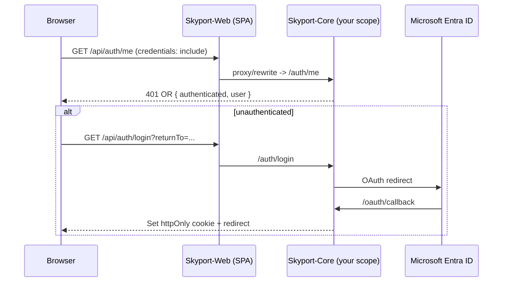

# Skyport-Core Auth Review — Backend Agent Handoff

This document is the brief for the **backend agent** reviewing authentication in
**Skyport-Core** (`vishwasdaikin/SkyportCore`, prod `https://skyport-core.vercel.app`).

It pairs with the frontend review done in `SkyportHome` (`vishwasdaikin/SkyportHome`).
The two reports will be merged into a single severity-ranked remediation list.

## Context

`SkyportHome` is a **frontend-only Vite + React SPA**. It has no server runtime and
delegates all real authentication to **Skyport-Core**, which runs the Microsoft Entra
OAuth confidential flow and issues an **httpOnly session cookie**. The SPA calls
`/api/auth/*` with `credentials: 'include'` (same-origin in prod via a Vercel rewrite).

## What the frontend already assumes about Core

The backend review must confirm these assumptions hold true in Skyport-Core:

- **Endpoints consumed by the SPA:** `GET /auth/me`, `GET /auth/login?returnTo=...`
  (also `&prompt=login` for a forced fresh login), `GET /auth/logout`, `GET /oauth/callback`.
- **`/auth/me` response contract:** the SPA reads
  `{ authenticated: boolean, user: { sub, email, name, role } }` and treats HTTP `401`
  (or `authenticated: false`) as "redirect to `/auth/login`".
  (See `src/auth/RequireAuth.jsx` and `src/auth/AuthNav.jsx` in SkyportHome.)
- **Session is an httpOnly cookie** (documented name `skyport_session`), signed with
  `SESSION_SECRET`. The SPA never reads a token in JS.
- **Sign-out** is a full-page navigation to `/auth/logout`; docs say Core uses a
  POST form + 303 redirect to apply cookie clears.
- **Sign-in policy** is enforced in Core's OAuth callback via
  `OAUTH_ALLOWED_MICROSOFT_EMAIL_DOMAINS` (domain allowlist) and `OAUTH_ADMIN_EMAILS`
  (assigns `role: 'admin'`, others `role: 'editor'`). On a disallowed domain Core clears
  the cookie and redirects with `?auth_error=access_denied&detail=...`.
- **Same-origin cookie:** prod uses `/api/*` rewrite to keep the cookie first-party;
  `SESSION_CROSS_SITE=1` switches the cookie to `SameSite=None; Secure`.

## Review scope (produce a report covering each item)

For each item, cite Skyport-Core `file:line`, rate severity (High / Medium / Low), and
recommend a fix.

1. **Stack + entry points** — framework/runtime; where `/auth/login`, `/oauth/callback`,
   `/auth/me`, `/auth/logout` are defined.
2. **OAuth flow correctness** — Entra confidential-client config; `state`/nonce validation;
   PKCE; redirect URI handling; error and `access_denied` paths.
3. **Session cookie attributes** — confirm `httpOnly`, `Secure`, `SameSite`, `Domain`,
   `Path`, `Max-Age`/`Expires`; verify `SESSION_CROSS_SITE` behavior.
4. **Token / JWT details** — signing algorithm + key source (`SESSION_SECRET`); claims
   (`sub`, `email`, `name`, `role`); expiry; clock-skew handling.
5. **Refresh + revocation** — refresh-token rotation? Server-side session invalidation /
   blacklist on logout, or cookie-clear only?
6. **Logout** — confirm POST-form + 303 cookie clear; confirm the cookie is actually
   invalidated (not just cleared client-side).
7. **Authorization / RBAC** — how `OAUTH_ALLOWED_MICROSOFT_EMAIL_DOMAINS` and
   `OAUTH_ADMIN_EMAILS` are enforced; which endpoints check `role`.
8. **Secrets management** — confirm no secrets committed; how env vars are loaded and
   validated at boot.
9. **CORS / CSRF** — `FRONTEND_ORIGIN(S)` config; allowed methods/credentials; CSRF posture
   on state-changing routes.
10. **Endpoint protection** — the middleware/guard that validates the cookie on protected
    APIs; any unauthenticated routes.
11. **Security headers + transport** — HTTPS enforcement, HSTS/CSP, rate limiting on auth
    endpoints.
12. **Contract match** — confirm the `/auth/me` response shape and status codes match what
    the SPA expects (see "What the frontend already assumes about Core" above).

## Deliverable format

A structured report mirroring the frontend review:

- Findings grouped by area, each with `file:line` citations.
- Severity rating per finding (High / Medium / Low).
- Recommended fix per finding, and whether it is a config/ops change or a code change.
- An explicit confirmation (pass/fail) of the `/auth/me` contract in item 12.

## Open frontend items that may overlap (reconcile with backend findings)

- Cookie attributes (`Secure`, `SameSite`, expiry) — owned by Core.
- 401 handling — Core must return clean 401s; SPA needs a shared fetch wrapper to act on them.
- RBAC enforcement — Core assigns `role`; both sides need to agree where it is enforced.
- `/auth/me` contract — the seam between the two repos; must match exactly.
